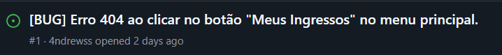

# 🚀 Projetos - Squad 16

Este repositório contém os artefatos desenvolvidos pelo Squad 16 ao longo do semestre. As entregas englobam diferentes desafios e soluções tecnológicas propostas nas disciplinas do nosso curso.

## 👥 Membros da Equipe
* [Andrews Queiroz](https://github.com/4ndrewss)
* [Arthur Ferreira](https://github.com/ArchangelLoer)
* Diogo Silas
* [Eduardo Borges](https://github.com/Eduardo-Borges18)
* Eliziane Mota

---

## 🏟️ Arena Pernambuco (Foco Atual)

O objetivo atual do Squad 16 é desenvolver uma aplicação web para conectar pessoas interessadas em eventos com a programação da Arena Pernambuco, otimizando o uso do espaço e facilitando a gestão por parte do administrador.

### 📍 Entrega 01: Histórias de Usuário (BDD)
Na primeira etapa tecnológica deste desafio, definimos as histórias principais focadas nas personas do Cidadão (que busca eventos) e do Administrador (que gerencia o espaço e cadastra a programação).
* 📄 **Documento de Histórias:** [Acessar PDF](docs/Histórias_de_Usuário_CESAR-Squad16.pdf)

### 💻 Entrega 02: Implementação MVC e Banco de Dados
Nesta segunda etapa, desenvolvemos o MVP funcional do sistema utilizando o padrão MVC (Model-View-Controller) com Java, Spring Boot, Thymeleaf para o Front-end e persistência de dados integrando o banco em memória H2.

#### 📌 Gestão Ágil e Organização
O acompanhamento das tarefas, a divisão técnica do time e o backlog da sprint de desenvolvimento foram gerenciados via Trello.
* 📋 **Acesso ao Quadro:** [Acessar Trello do Squad 16](https://trello.com/b/svXcgUeL/trellosquad16)


#### 🎥 Screencast de Apresentação
Vídeo demonstrativo mostrando o sistema rodando na prática. Apresentamos o fluxo completo: o cadastro de novos eventos pelo Administrador (passando pela validação de regras de negócio no Back-end e salvamento no banco H2) e a visualização dinâmica do catálogo pelo Cidadão.
* ▶️ **Acesso ao Vídeo:** [Assistir no YouTube](https://youtu.be/UC4oC0afoys?si=dSwLDU9J9lpUnc_2)

### 🛠️ Entrega 03: Novas Funcionalidades e Bug Tracker
Nesta etapa, implementamos as lógicas de **Reserva de Ingressos** (Cidadão) e o **Controle de Acesso/Check-in** (Administrador).

#### 1. Screencast do Sistema (Novas Histórias)
Abaixo está o link para o screencast do nosso sistema funcionando, com áudio e ênfase no teste prático das novas histórias (H3 e H4):
* [▶️ Assistir ao Screencast da Entrega 03 no YouTube](https://youtu.be/bNyfRR6WtCA?si=e_mH0I5HD2Cyksfm)

#### 2. Versionamento e Issue/Bug Tracker
Nosso ambiente de versionamento segue ativo com commits frequentes no repositório. Para a nossa organização ágil, o Squad utiliza o Trello como gerenciador de tarefas principal e o **GitHub Issues** operando estritamente como nosso rastreador de bugs (Bug Tracker).

Abaixo está o print atualizado da nossa aba de Issues no GitHub, demonstrando o registro, acompanhamento e resolução dos bugs encontrados durante o desenvolvimento das novas histórias:



### 📌 Entrega 04: Setup e Execução do Projeto

#### 🎥 Screencast da Aplicação

Assista ao vídeo demonstrativo apresentando as principais funcionalidades do sistema, o fluxo de navegação e a resolução dos requisitos propostos:

[👉 **Clique aqui para assistir ao Screencast**](https://youtu.be/lzO26F84zTI)

#### 🐛 Bugs Encontrados e Resolvidos (GitHub Issues)

Durante a fase de testes, atuamos na correção de bugs críticos envolvendo regras de negócio, persistência de dados e exibição no front-end. O registro completo de nossa atuação pode ser visto abaixo:


*Você pode conferir os detalhes técnicos de cada correção acessando a aba [Issues do nosso repositório](https://github.com/ArchangelLoer/CESAR_Squad16/issues?q=is%3Aissue+is%3Aclosed).*

#### ⚙️ Guia de Setup e Execução Local
Para testar as funcionalidades desenvolvidas e verificar as correções aplicadas em sua própria máquina, siga as instruções detalhadas abaixo.

##### 🛠️ Pré-requisitos

Antes de iniciar, certifique-se de ter instalado em sua máquina:

* **Java JDK 17**: O projeto foi desenvolvido utilizando a versão 17 do Java.
* **Git**: Para clonar o repositório.
* **Editor de Código**: Recomendamos o **VS Code** com a extensão *Spring Boot Extension Pack*.

##### 🚀 Como Rodar o Projeto

Siga os passos abaixo no seu terminal:

1.  **Clone o repositório:**
    ```bash
    git clone https://github.com/ArchangelLoer/CESAR_Squad16.git
    ```

2.  **Entre na pasta do projeto:**
    ```bash
    cd CESAR_Squad16
    ```

3.  **Execute a aplicação utilizando o Maven Wrapper:**
    ```bash
    ./mvnw spring-boot:run
    ```
    *Nota: No Windows (PowerShell), utilize `.\mvnw spring-boot:run`.*

4.  **Aguarde a inicialização:**
    O sistema estará pronto quando a mensagem `Started EventoApplication in X seconds` aparecer no console.

##### 🌐 Acesso ao Sistema e Banco de Dados

Com a aplicação rodando, você pode acessar:

* **Aplicação (Front-end):** [http://localhost:8080](http://localhost:8080)
* **Console do Banco de Dados (H2):** [http://localhost:8080/h2-console](http://localhost:8080/h2-console)

##### 🔑 Credenciais do Banco de Dados (H2)
Para conectar ao banco de dados no console, utilize as configurações abaixo:

* **Saved Settings:** `Generic H2 (Embedded)`
* **Driver Class:** `org.h2.Driver`
* **JDBC URL:** `jdbc:h2:file:./data/banco-arena`
* **User Name:** `sa`
* **Password:** *(deixe em branco)*

---

## 🤖 Projeto Anterior: MVP AIBox

Nesta frente de inovação acadêmica anterior, definimos as regras de negócio e o escopo para a criação de uma plataforma educacional baseada em IA para geração de questões e feedback em tempo real.

### 📍 Entrega 01: Requisitos e Prototipação
Foram definidas 7 histórias de usuário abordando o ecossistema da plataforma (Visão do Professor, Aluno, Administrador, Coordenador e Responsáveis), além da criação da interface visual.
* 📄 **Documento de Histórias:** [Acessar PDF](docs/historias_usuario_squad16.pdf)
* 🎨 **Protótipo de Baixa Fidelidade (Figma):** [Acessar Protótipo](https://www.figma.com/design/XmK2FAJqpqz33PFxcNuZdE/Sem-t%C3%ADtulo?node-id=0-1&t=HQwXetTn129vI3Iw-1)
* 🎥 **Screencast do Protótipo:** [Assistir no YouTube](https://youtu.be/2EmizW1yJvg?si=9PMVLK93Ir1tXMO8)
